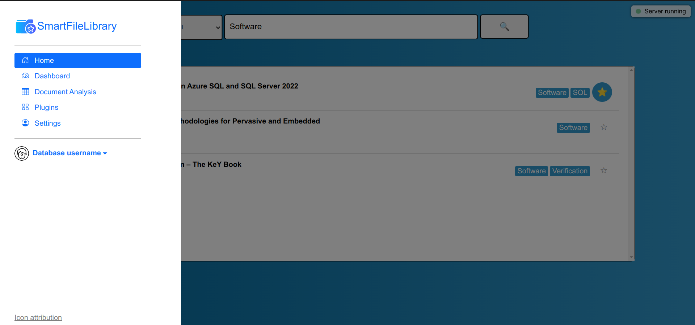

# SmartFileLibrary

[](https://www.python.org)

[](https://opensource.org/licenses/MIT)


The problem this project in development tries to fix are local folders full of PDFs, code snippets and datasets, that typically have very nontelling filenames (like DOI numbers).

SmartFileLibrary is is an digital library, backed by a local database hosted by PostgreSQL. The project's goal is to semiautomatically insert documents from local directories into the library. This includes LLM based analysis of documents to infer metadata and supply keywords. Semiautonomous insertion can be augmented for scientific papers using the API for the `crossref` metadata database.

To strengthen privacy, the project strives to always offer local compute options.

## Features

The project is ongoing. Some features are still in development.

#### Currently available
- Local database to organize the files.
- Multiple options to infer metadata like title and publishing year from the document. Includes locally deployed AI models.
- AI generated keywords based on the *title* of the file.
- Enhance the automated process for scientific works using the `crossref` metadata database.
- Basic (experimental) webinterface for queries. The project has a coding first mentality. To get all features, you need to code in Python. The GUI is seperated in [here](rsc/).



#### Ongoing work
- Include more models for metadata inference. At the top of the list is [Idefics2-8b](https://huggingface.co/HuggingFaceM4/idefics2-8b): **It's performance is remarkable** for an open source visual model this size.
- Support common APIs like ChatGPT-V, Claude, etc.
- Add more features to the webinterface.
- Tests


## Installing
The project is written for Linux, Python 3.10+ and has a number of additional requirements

- PostgreSQL 14.11
- (optionally, see below) a text-to-text model from Huggingface to generate keywords

Optionally, you may setup a virtual environment.

```bash
python3 -m venv path/to/new/venv
cd path/to/new/venv
source bin/activate
```

Then download the code, navigate into that directory and run

```bash
pip3 install -r requirements.txt
pip3 install .
```


## Basic Use

### Setup

First, you need to setup an account over on PostgreSQL and a database. You likely do not want to use the default database which is named after the user account. 

### Manual insertion

The fallowing demonstrates the fully manual insertion of a publisher and a book into the DB. Note that all actions are being logged into a file called `locallog.txt`. This allows you to clear the DB later on and **replay** your previous actions.

```py
from smartfilelibrary import DatabaseInterface

# Enter credentials to local DB.
db = DatabaseInterface("dbname", "user", "password")
# remove any previous tables and insertions
# Good practice to reset any counters.
db.cleardb()

## If you clear, you may want to replay previous actions:
# db.executefile(locallog.txt) 

# Inserts a number of standard values.
# Will likely throw an error if you execute from file before,
# given that file also has seen the standardsetup.
# TLDR: Either standardsetup or executefile.
db.standardsetup()

# Add publisher, returns ID, required for adding books
apress = db.addpublisher("Apress")

# Add topics and subtopics
db.subtopic('Data Science', 'Database')
db.subtopic('Database', 'SQL')

# Add book and a file corresponding to this book (there may be many files per book)
sqlbook = db.addbook('Expert Performance Indexing in Azure SQL and SQL Server 2022', 
    2023, apress, 'book', ('SQL', ))
db.addfile(sqlbook, "path/to/book1.pdf", 300, "First Half")
db.addfile(sqlbook, "path/to/book2.pdf", 349, "Second Half")

# Commit all changes
# db.commit_transaction()

# Commit all changes and close connection
db.finish()

```
The above registers a publisher, then a book by giving the title, publishing date, publisher, form and keywords.
Then, a book consists of one or several files, one is added with book_id, path and number of pages.

Now this all seems pretty boring to do, right? We may want to speed this process up a notch. This project is still at the beginning of doing so.

### Semiautomated process

The tutorial for the semiautomated process was moved into its own file [here](TUTORIAL_SEMIAUTO.md).

## Webinterface

**Webinterface support is still experimental. It is in active development.**
After executing the below, it will request the password for the user.
```py
python3 -m smartfilelibrary db_name user_name 

```
Then, you can open the . It has mainly been tested in Chrome and Firefox.


## The DB
The DB layout can be checked in . It is in third normal form. It contains the fallowing "objects":

- Book: Has properties title, Publisher, etc. May represent something other than books, like a codebase.
- File: A Book can consist of many files.
- Publisher: depending on the use, this may be the publishing company or the author
- Form: code, text, dataset, etc.
- Topic: keywords
- UseCase: the context(s) in which some resource is being used

Then, it also contains the reasonable relations:

- usecase_book: UseCase <-> Book; many to many
- book_topic: Book <-> Topic; many to many
- subtopic_of: Topic <-> Topic; many to many

The other relations like form_book, being either one-to-one or one-to-many have been folded into the object tables.

## Limitations

- Currently, this project can only do scientific publications fully automatically, thanks to the crossref metadata database and its free API access. These shortcommings could be reduced in the future by having AI models search the PDF for metadata like title, publisher, author, publishing year, etc.

- There is currently no option to use the ChatGPT API but this may be added in the future. This is currently not a priority since the goal is to rul locally as much as possible.